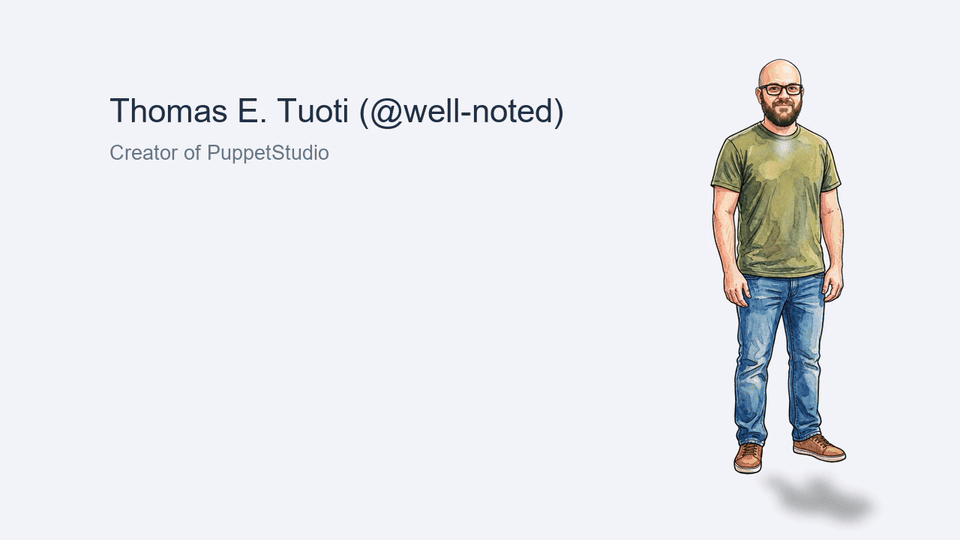
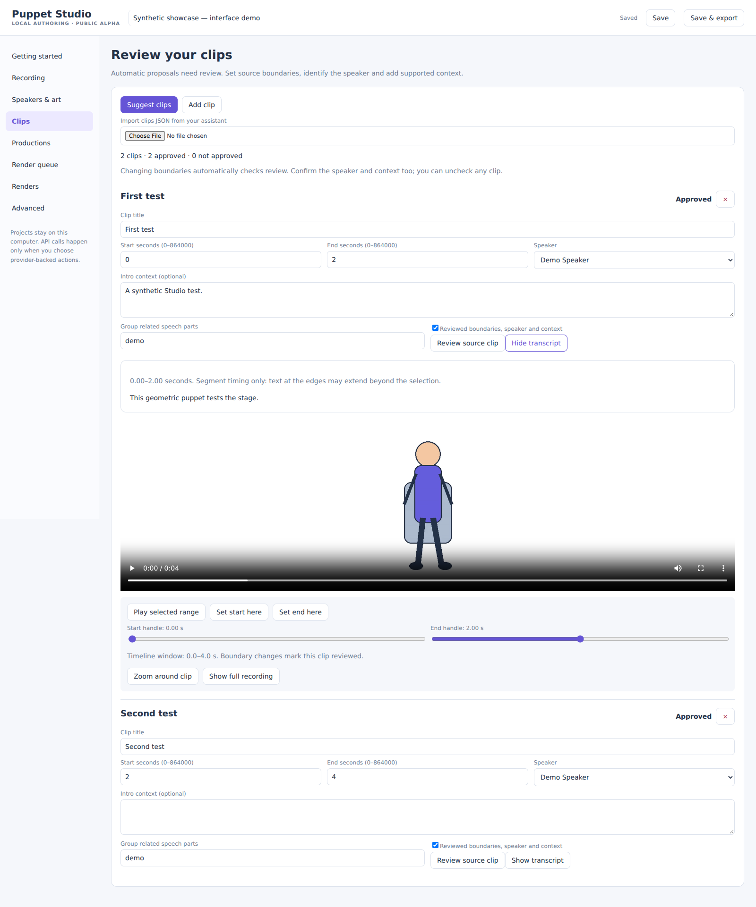
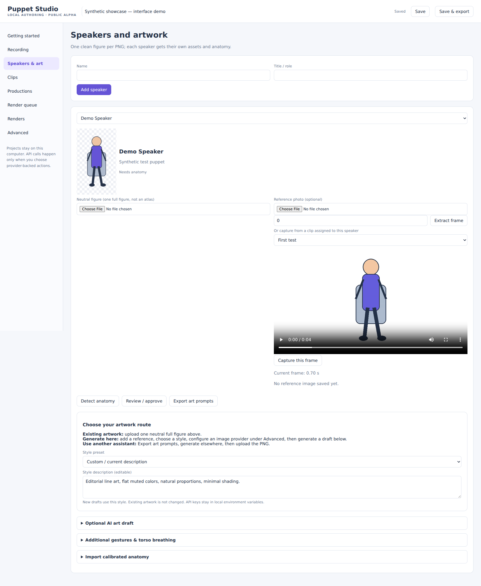
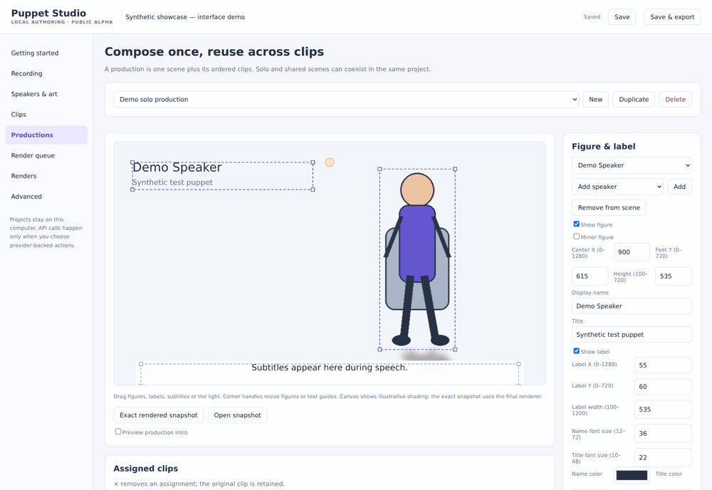
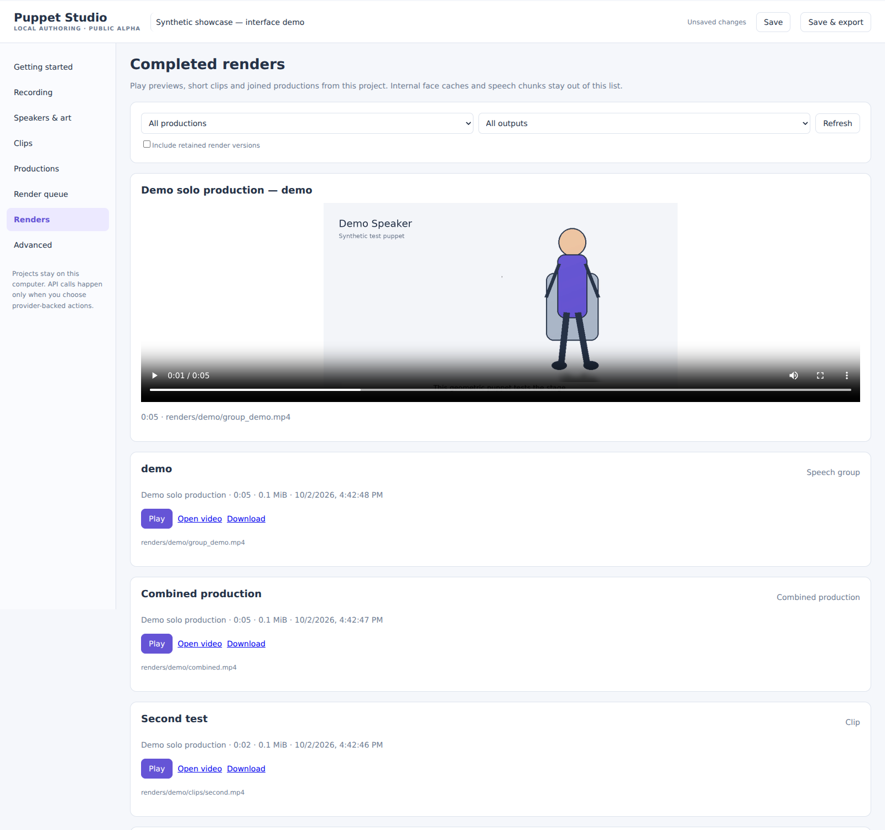

# Puppet Studio

**Turn recorded conversations into illustrated, captioned puppet productions.**

Puppet Studio is a local authoring tool for recorded talks, interviews and panels.
Import a recording, review suggested clips, give each speaker an illustrated
figure, compose your scenes, and render a batch while you are away.

Created by **Thomas E. Tuoti ([@well-noted](https://github.com/well-noted))**.
Licensed under the [MIT License](LICENSE).

> **Public alpha:** Windows is the primary setup target. The managed installer
> is ready for clean-computer testing; it has not yet been validated end to end
> on a fresh Windows installation. Review a short speaking preview before an
> overnight batch. See [validation status](docs/VALIDATION.md).

<!-- For a GitHub video player with sound, replace the GIF below with the bare
GitHub attachment URL obtained by uploading docs/media/welcome_clip.mp4 in a
GitHub Markdown editor. See the ignored docs/media/README.md capture guide. -->


The demo plays inline above as a silent animation. **[Original video with audio
(18 seconds)](docs/media/welcome_clip.mp4).** This public showcase features creator
Thomas E. Tuoti's illustrated character, with lip synchronization, a timed gesture,
name/title, subtitles and a stage shadow. Conference artwork and recordings are excluded.

## What you can make

- **Captioned speaker clips:** names, titles, contextual intro slides and timed subtitles.
- **Reusable productions:** one solo layout for all of a speaker's clips, another
  for a second speaker, or a shared scene with several puppets.
- **Custom compositions:** position and resize figures and labels, mirror puppets,
  choose individual text colors, add backdrops, and preview 2D lights and shadows.
- **Controlled movement:** lip synchronization, preserved upper-face artwork,
  silence/rest-mouth handling, optional torso breathing and registered gesture poses.
- **Repeatable batches:** seeded gesture timing, resumable face caches, individual
  clips and assembled productions, progress logs and Windows completion sounds.
- **Flexible preparation:** local transcription and clip proposals, optional
  provider-backed tools, or a prompt pack for your preferred chat assistant.

You bring the recording and artwork. No conference media, likeness assets,
transcripts, API keys or model checkpoints are included. All current interface
showcase captures use newly generated geometric test artwork.

## Quick start on Windows

1. Download and extract a release package, or clone this repository. Open the
   folder containing `launch.cmd`. Keep it separate from older animation tools.
2. In PowerShell, run:

   ```powershell
   .\launch.cmd
   ```

3. Follow **Getting started** in the browser. First check your computer and use
   **Find and verify existing animation tools**. If needed, choose the managed
   local animation installation.
4. Import a recording, transcribe it and review a clip. Add its speaker and
   artwork, then detect and approve the anatomy.
5. Create a production and render a **short speaking preview**. Check the mouth,
   silence, colors, gesture edges and subtitles before rendering everything.

Setup displays an environment/install/verification stage bar and elapsed-time
activity indicator, including while pip is quiet. The bar represents setup
stages rather than an inferred package-install percentage.

First launch finds Python 3.10–3.12 or downloads a private Python runtime, creates
Studio's `.venv`, and installs its dependencies. The animation-tool installation
is a separate guided action; it can download FFmpeg, SadTalker, a private model
Python environment and model weights. It verifies existing environments first
and does not install packages into an external CUDA environment.

| Requirement | What to expect |
| --- | --- |
| Windows x64 | Primary target for guided installation. |
| Internet on first setup | Python, packages and model weights may need downloading. |
| Disk space | Allow at least 15 GiB free for managed animation setup. |
| NVIDIA GPU and working driver | Required by this build's speaking-face backend. Driver installation is separate. |
| 4 GB VRAM | Low-memory settings use 256-pixel, batch-one inference. Verify with a preview; fit depends on the environment. |
| No NVIDIA GPU | Local transcription, scene composition and still-face gesture tests remain available. CPU lip sync is not provided. |
| API credentials | Optional for local workflows. Required only for selected hosted services. |

Managed tools default to `%LOCALAPPDATA%\PuppetStudio\tools`. Set
`STUDIO_TOOLS_HOME` before launch to use another drive. Studio does not change
the global PATH or require administrator access for its managed setup. Successful CUDA and
SadTalker startup verification saves the animation paths for new projects on the
same computer. Existing custom project paths are preserved; use **Find and verify
existing animation tools** to configure a project that has no paths yet.

For a fresh-machine test, use the [clean installation checklist](docs/CLEAN_INSTALL_TEST.md).
When updating an existing installation, preserve `projects/` and `.venv/`.

<details>
<summary>Manual setup and other platforms</summary>

With a supported Python already installed:

```powershell
python setup.py --transcription --anatomy
.\launch.cmd --project ".\projects\my_project"
```

Linux/macOS have a manual Studio setup path; the managed animation installer
is Windows-only:

```bash
python3 setup.py --transcription --anatomy
.venv/bin/python studio.py --project projects/my_project
```

FFmpeg and a compatible animation environment must be provided separately on
those platforms. Cross-platform neural rendering is not verified by this alpha.

</details>

## From recording to production

### 1. Import, transcribe and review

Start with the full recording in **Recording**. Local Whisper transcribes on CPU;
its first use downloads a model. You can also import timed JSON/SRT or select a
hosted transcription service.

Suggest clips using local sentence/pause rules, or opt into semantic API planning.
In **Clips**, assign the speaker, view the excerpt's transcript, and play the
selected source interval. Playback pauses at its end. Adjust the boundaries with
sliders, numeric fields or **Set start/end here**.

Review status stays visible, with approved/unapproved totals. Changing boundaries
checks the review box; changing speaker or context clears approval. You can
uncheck any clip that still needs review. Speaker identity is assigned manually;
automatic diarization is not included.



*Synthetic interface demo; geometric artwork and test transcript.*

### 2. Build and approve a speaker

In **Speakers & art**, add the name and title and provide one complete figure PNG.
Use existing artwork, request a draft through a configured image API, or export
art prompts for another assistant. Style presets are editable.

To get a source reference, choose a clip assigned to that speaker, pause on a
clear frame and click **Capture this frame**. Open or download the extracted
image directly; numeric timecode entry remains available.

Detect anatomy, inspect the overlay and approve it. Stylized faces can defeat
automatic detection; a reviewed profile can be imported instead. Generated
artwork is a draft that needs likeness, anatomy and alignment review.



*Synthetic interface demo of the clip-based reference selector. Anatomy approval is a separate step.*

### 3. Compose once, reuse across clips

A **clip** is a source interval. A **production** is a reusable scene with an
ordered list of clips. You do **not** need a separate production for every clip.

For example, create **Speaker A solo** and add all of A's clips. Create
**Speaker B solo** with B's clips. Add a shared production when you want both
figures on stage. Remove an assignment with **×** without deleting the source
clip; use the ordering controls to change playback order.

Position figures, labels and subtitles; drag corner guides to resize; set
speaker-specific text colors; mirror puppets; choose backdrops and lights.
Browser lighting is illustrative. An exact snapshot uses the final renderer;
fonts and antialiasing can differ from the browser preview.

Choose each clip's own intro, the production intro before every clip, or no
intros. Output choices support separate clips, an assembled production, or both.
Clips sharing a Group also get an assembled group video. Long speeches keep their
render chunks and are joined with continuous original audio.



*Synthetic interface demo: moving and resizing a figure. See the [full scene screenshot](docs/media/scene-composition.png).*

### 4. Preview, batch render and watch

Render a short preview for each new speaker. Then select your productions and
run the queue. Jobs show timestamped progress and retained logs. The **Renders**
tab lists completed previews, clips and assemblies, with playback, open and
download controls.

After saving the project, you can also run a batch from PowerShell:

```powershell
.\run.cmd --project ".\projects\my_project"
```

Select a production by its ID or generate previews:

```powershell
.\run.cmd --project ".\projects\my_project" --production speaker_a_solo
.\run.cmd --project ".\projects\my_project" --preview
```



*Synthetic composition outputs; the still-face test backend does not perform lip synchronization.*

## Artwork and motion requirements

The neutral image must show **one complete figure**, on white or a transparent
background. Pose sheets must be split into individual figures first; automatic
sheet disassembly and complete body-rig generation are not included.

Gesture images must match the neutral canvas, scale, head, chair and legs.
Only the arm envelope changes. Movement supports manual cues, user-defined
emphasis phrases, sparse timed randomness and repeatable seeds. More visual
variety requires more distinct, registered poses.

Torso breathing needs a grayscale torso-only mask. Without one, breathing is
disabled so the chair stays still. Local generation buttons provide reviewable
mask and closed-mouth proposals and padded inference-bust extraction. Optional
API buttons can redraw lips or propose gestures; alignment is not guaranteed.
Generating a draft does not change the neutral master.

**Prepare gesture locally** copies unchanged pixels from your neutral figure.
Choose the gesture ID, an editable rectangle inside the arm region, optional
same-size grayscale mask, and the pose image. It saves a draft with a protected
pixel-change count. Open the draft and import it only after reviewing arm edges.
White mask pixels allow changes; black preserves the neutral. Soft edges blend
inside the allowed region. Canvas mismatches are rejected, not resized.

This is deterministic compositing, not anatomical registration: it cannot fix
bad hand anatomy or relocate a misaligned arm. A broad rectangle may retain
changed torso texture; use a tighter mask when necessary. Neither source is
modified, and importing a draft still checks the neutral artwork identity.

The standalone helper preserves RGBA alpha:

```powershell
python prepare_gesture.py --neutral neutral.png --pose gesture.png --out gesture_prepared.png
# Optional same-canvas mask:
python prepare_gesture.py --neutral neutral.png --pose gesture.png --mask arms_mask.png --out gesture_prepared.png
```

Inspect gesture edges on your chosen background: inferred transparency can
leave fringes or remove detail. Test both speaking and silent intervals; source
art and neural inference still affect articulation and face stability.

## Optional AI services

Advanced settings are collapsible. The basic local workflow requires no API key.

| Route | What leaves the computer when selected |
| --- | --- |
| Local Whisper and local clip rules | No audio/transcript upload for these operations; model downloads may occur. |
| Hugging Face download token | Authenticates model downloads; it does not select hosted transcription. |
| Hugging Face hosted ASR | Audio in cached 60-second chunks. Complete returned timestamps are required. |
| Compatible transcription API | Audio, limited to 24 MiB per request in this adapter. |
| Semantic clip planning | Transcript text. |
| Image generation/editing | Reference artwork/photo and the requested prompt. |
| External assistant handoff | You decide which exported files to share with your chosen chat interface. |

Hosted services can incur charges. Configure the endpoint/model and check its
capabilities before unattended use. Compatible API routes include
`audio/transcriptions`, `chat/completions` and `images/edits`; compatibility
varies. This is not a universal adapter for every model vendor.

Hugging Face has separate controls for download authentication and hosted ASR.
Both use `HF_TOKEN` by default; choose another hosted variable name to separate
them. UI-entered tokens stay in the server process, are inherited by workers,
and are excluded from project JSON and exports. Restarting Studio clears them.

For compatible APIs, supply a key in the launch terminal:

```powershell
$env:STUDIO_API_KEY = "your key"
.\launch.cmd
```

**Export assistant prompt pack** writes prompts, a transcript copy and speaker
information under `handoff/`. The prompt asks the assistant to request the
necessary transcript and missing context rather than assume access to your disk.
No subscription to a particular chat interface is required.

## Projects, exports and recovery

Everything you author lives under the selected project folder:

| Path | Purpose |
| --- | --- |
| `project.json` | Speakers, clip assignments, productions and settings. |
| `media/`, `assets/`, `transcript/` | Imported content and prepared assets. |
| `exports/` | Project export written by Save & export. |
| `handoff/` | Files and prompts for an external assistant. |
| `work/face_cache/` | Resumable neural inference caches. |
| `renders/PRODUCTION/clips/` | Individual rendered clips. |
| `renders/PRODUCTION/combined.mp4` | Assembled production. |
| `renders/PRODUCTION/group_NAME.mp4` | Related clips assembled by Group. |
| `renders/queue_report.json` | Completed and failed jobs. |

Layout, text and color changes can reuse compatible face inference. Changes to
artwork, anatomy, audio or inference settings require a different cache.
Completed caches survive composition failures. Run the same command again to
resume outputs whose inputs still match.

Keep Studio's terminal open. Use **Stop job** to stop a running job tree.
After abrupt interruption, confirm no worker remains before removing only the
lock named in the error. Do not delete face caches to fix an assembly failure.

<details>
<summary>Troubleshooting and diagnostics</summary>

- **Setup or model startup fails:** use the Advanced setup/model checks. Inspect
  `work/setup_report.json`, `work/cuda_probe.log` and `work/startup_probe.log`.
  Passing startup does not prove checkpoint availability or render quality.
- **Quoted Windows path fails:** use the path picker or paste the complete path;
  supported local-path fields strip surrounding quotes.
- **Wrong-art cache error:** use the intended neutral artwork and regenerate the
  matching cache. Do not bypass the identity check.
- **Transcript validation fails:** inspect `work/transcription_raw.json` and
  `work/transcription_validation_error.json`. Matching recognizer output is
  retained for retries; timestamps are not silently sorted or shifted.
- **Zero-duration words:** neighboring timing may be shared; if it cannot be
  anchored, original segment captions are used with a warning. Review clip edges.
- **Hosted ASR has no usable timestamps:** choose a timestamp-capable model,
  use local Whisper or import timed JSON/SRT. Raw hosted responses are retained
  in `work/hf_transcription/`; Studio does not invent caption timing.
- **Decoder reports `metadata_errors`:** close Studio and repair its dependency:

  ```powershell
  .\.venv\Scripts\python.exe -m pip install "av>=11,<19"
  .\launch.cmd
  ```

Read-only model diagnostics from the terminal:

```powershell
.\.venv\Scripts\python.exe doctor.py --project ".\projects\my_project" --model
```

</details>

## Current scope

One recording per project, with multiple speakers, clips and productions.
Render geometry is currently 1280×720. Shadows use 2D silhouette projections;
lighting is tinting rather than physical reconstruction. Audio cleanup offers
denoising/loudness normalization, not restoration of missing speech detail.
The still-face backend tests composition and gestures with original audio but
has no lip synchronization.

Automatic speaker identification, fully automatic faithful puppet creation,
arbitrary articulated gestures and guaranteed provider compatibility are outside
this alpha's current scope. Clean Windows installation, broader accessibility,
interactive browser behavior and live provider integrations need further testing.

See the [roadmap](docs/ROADMAP.md), [validation notes](docs/VALIDATION.md) and
[third-party dependencies](docs/DEPENDENCIES.md).

## Development and contributions

Bug reports and contributions are welcome. For a useful report, include the
Studio version, OS, GPU/VRAM, backend, exact error and relevant redacted logs.
A short example you have permission to share is especially helpful. Never
include keys, tokens or private conference recordings without permission.

Run the checks after installing development/runtime dependencies:

```powershell
python -m unittest discover -s tests -v
node tests/test_ui.js
```

Node is needed only for the JavaScript development checks. Those tests are
DOM-free and supplement browser testing.

A synthetic demo exercises composition without real artwork or a GPU:

```powershell
python examples/make_demo.py projects/demo
python studio.py --project projects/demo render
```

It tests captions, intros, gestures and joining with the still-face backend;
it does not validate neural lip sync.

README showcase images, GIFs and videos belong in `docs/media/`. The finished
creator demo is `welcome_clip.mp4`, with `finished-production.png` as its poster.
Other interface captures use synthetic geometric artwork.
Local projects, source media, generated output and credentials are excluded by
`.gitignore`; showcase captures remain trackable.

### Mark gestures while listening

Under **Productions → Motion & gestures → Manual gesture timing**, select a clip
assigned to the displayed speaker. Play it, select the uploaded gesture and
duration, then click **Add gesture here**. Playback can continue while marking.
Start and end are measured from that clip's start, excluding its intro slide.
New cues apply only to that clip; older global cues are labeled as such. Adding
a cue switches the speaker to manual timing. Save before rendering.

The top-bar **Dark mode / Light mode** button changes authoring controls only.
Appearance is remembered in this browser; scene backgrounds, captions and
output artwork retain the colors selected in the production.

## License and credits

Copyright © 2026 **Thomas E. Tuoti (@well-noted)**. Puppet Studio's original code
and documentation are available under the [MIT License](LICENSE).

Third-party software, model weights, input media and artwork keep their own
licenses and rights. This repository's MIT license does not relicense those
materials. External tools and checkpoints are downloaded separately; check
upstream terms before redistributing them. See [dependencies and sources](docs/DEPENDENCIES.md).
